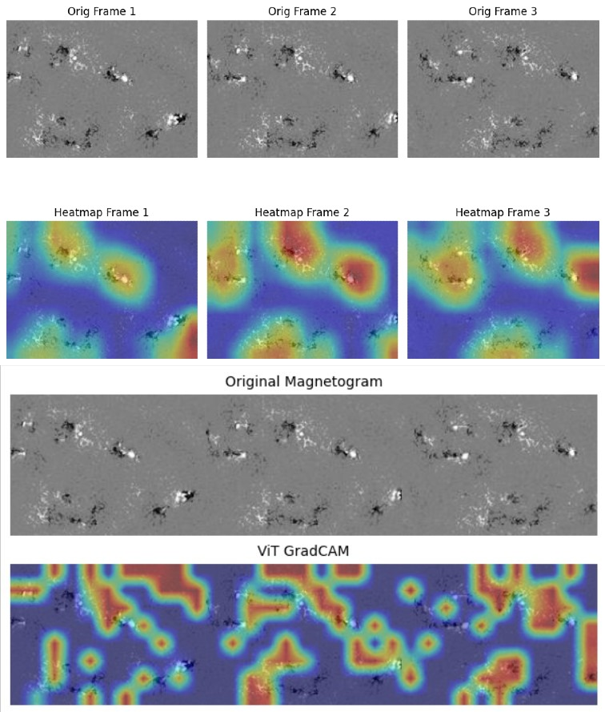

# Solar Flare Prediction with Deep Learning

This repository contains the paper written for the project of the Elective AI course, the project is about **solar flare forecasting** using **multi-temporal full-disk line-of-sight (LOS) magnetograms** and deep learning models. The repository will not provide the code used for the experiments.

The project compares **CNN–LSTM**, **Encoder–LSTM**, and **Vision Transformer (ViT)** architectures to predict the occurrence of **strong solar flares (M/X class)** within 24 hours.
 

---

## Problem

Solar flare prediction is challenging due to:
- strong class imbalance
- complex spatial–temporal dynamics
- limited labeled data for extreme events

This work focuses on learning directly from **image sequences**, avoiding handcrafted features and preserving realistic forecasting conditions.

---

## Data

- **Source**: Helioviewer API (MDI + HMI instruments)
- **Time range**: 1996–2024
- **Input**: sequences of 3 LOS magnetograms  
  (72h, 48h, 24h before the event)
- **Resolution**: cropped and standardized (180 × 130)
- **Classes**:
  - `0`: A/B/C flares (quiet)
  - `1`: M/X flares (strong)

Final dataset:
- 4337 samples  
- 36% strong flares  
- Stored in HDF5 format

Class imbalance handled via **undersampling + weighted loss**.  
No data augmentation is used due to physical constraints.

---

## Models

- **CNN–LSTM**  
  CNN extracts spatial features, LSTM models temporal evolution.

- **Encoder–LSTM**  
  CNN encoder pre-trained with reconstruction, then combined with LSTM.  
  Tested with frozen and fine-tuned encoders.

- **Vision Transformer (ViT)**  
  Three images concatenated spatially and processed via self-attention.

---

## Validation Strategy

A **time-series K-Fold** approach is used:
- training → validation → test (chronological order)
- test set fixed to most recent data
- no temporal leakage

This simulates real operational forecasting conditions.

---

## Metrics

Evaluation metrics:
- Accuracy
- Precision
- Recall
- F1-score
- False Alarm Ratio (FAR)

Metrics are computed on chronologically unseen test data.

---

## Explainability

- **Grad-CAM** applied to CNN–LSTM models
- Attention visualization for ViT

Results show alignment with physically meaningful solar active regions.

---

## Tech Stack

- Python
- TensorFlow / Keras
- NumPy, Pandas
- OpenCV
- Matplotlib
- HDF5
- SunPy

Deterministic training enforced via fixed random seeds.

---

## Notes

- CNN–LSTM is the most stable under validation imbalance
- ViT achieves competitive performance but is more sensitive to validation bias
- Validation set composition impacts performance more than architecture choice

---
